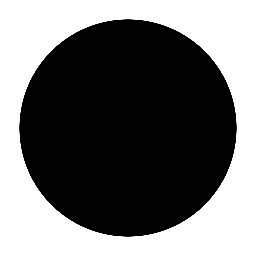

# circle-simple-anims



```glsl
#version 150

uniform float time;
uniform vec2 resolution;
uniform vec2 mouse;
uniform vec3 spectrum;

uniform sampler2D texture0;
uniform sampler2D texture1;
uniform sampler2D texture2;
uniform sampler2D texture3;
uniform sampler2D prevFrame;
uniform sampler2D prevPass;

in VertexData
{
    vec4 v_position;
    vec3 v_normal;
    vec2 v_texcoord;
} inData;

out vec4 fragColor;

void main(void)
{
    vec2 uv = -1. + 2. * inData.v_texcoord; // -1 ~ +1
    float c = distance(vec2(0), uv);    
    c = smoothstep(abs(sin(time)), abs(sin(time))+.003, c);
    fragColor = vec4(c,c,c,1.0);
}
```