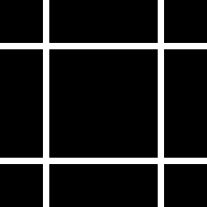

# square-lines



```glsl
#version 150

uniform float time;
uniform vec2 resolution;
uniform vec2 mouse;
uniform vec3 spectrum;
uniform float V;
uniform float W;

uniform sampler2D texture0;
uniform sampler2D texture1;
uniform sampler2D texture2;
uniform sampler2D texture3;
uniform sampler2D prevFrame;
uniform sampler2D prevPass;

in VertexData
{
    vec4 v_position;
    vec3 v_normal;
    vec2 v_texcoord;
} inData;

out vec4 fragColor;

void main(void)
{
    vec2 uv = inData.v_texcoord; // 0 ~ 1

    float l = step(uv.x, V) - step(uv.x, V-W);
    float r = step(1-uv.x, V) - step(1-uv.x, V-W);
    float b = step(uv.y, V) - step(uv.y, V-W);
    float t = step(1-uv.y, V) - step(1-uv.y, V-W);
    fragColor = vec4(vec3(clamp(l+r+b+t, 0, 1)),1.0);
}
```